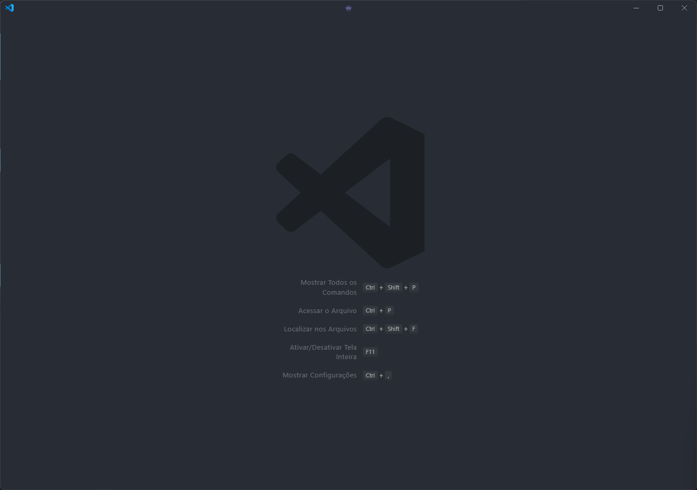
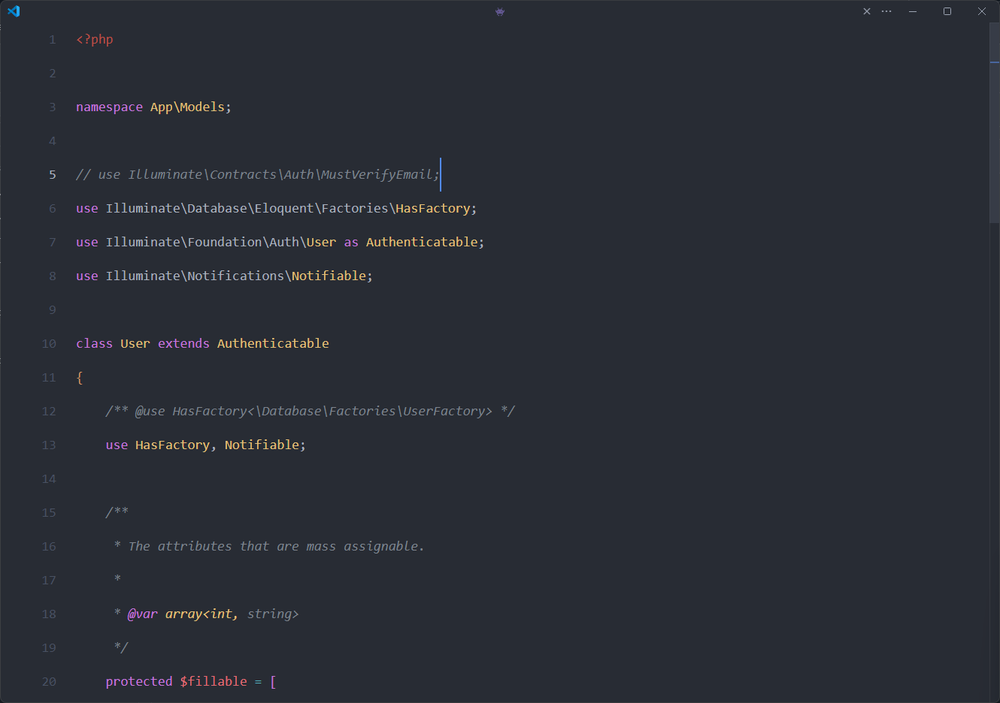
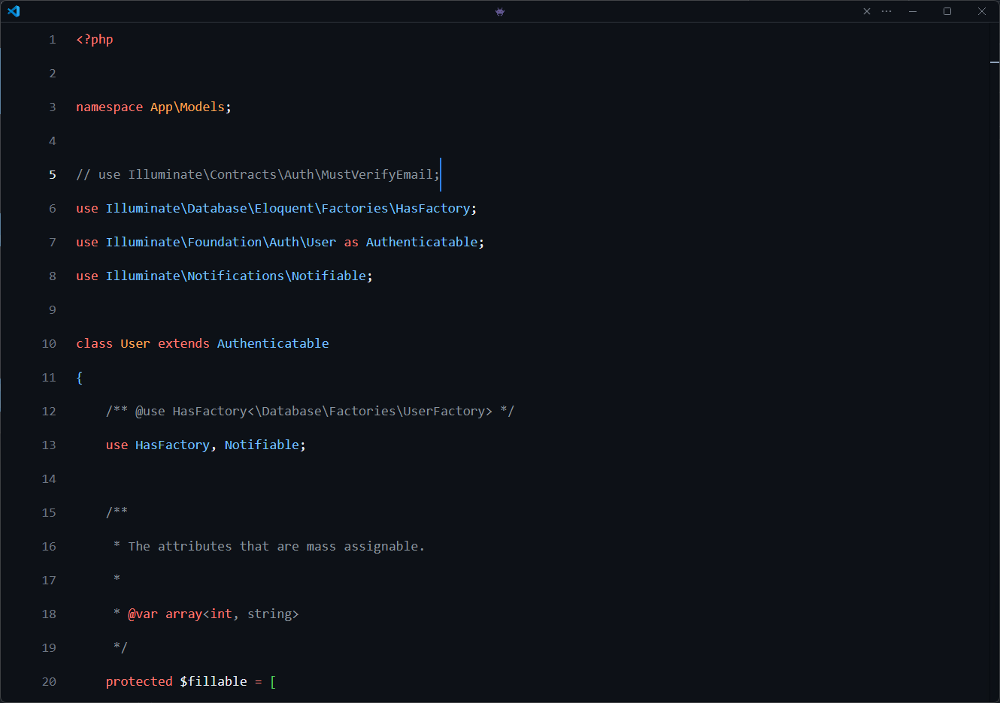
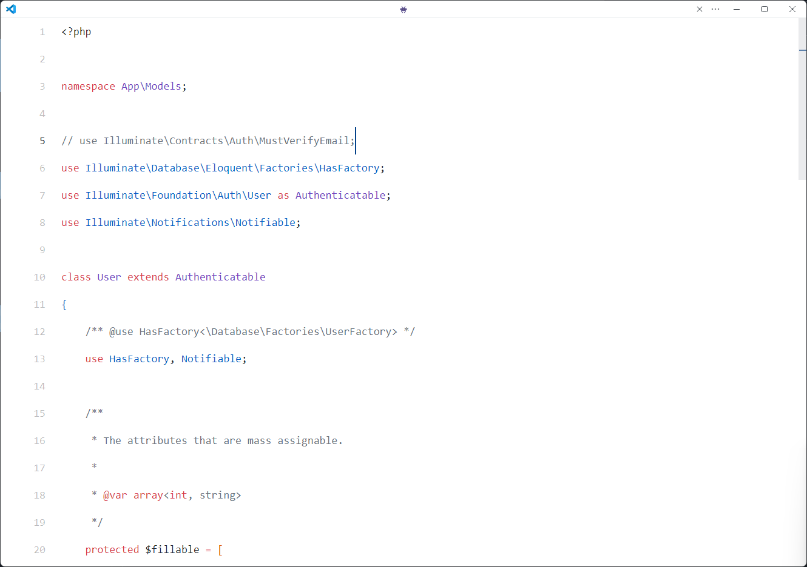
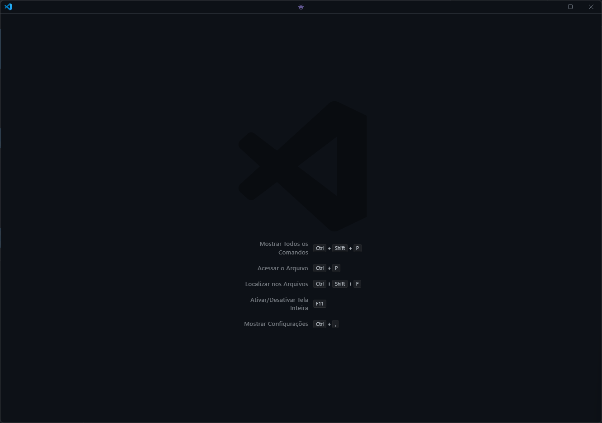

# Minimal-VSCode

  

Essa são as minhas configurações do VSCode pra deixar ele com o mínimo de informação na tela. Eu utilizo muitos atalhos e removo muitas coisas da tela que também podem ajudar a agilizar os processos.

## Fontes

No momento eu tô utilizando a MonoLisa, mas minhas opções e sugestões são:
1. MonoLisa
2. JetBrains Mono
3. DankMono
## Extensão

É necessária a extensão: 

[Apc Customize UI++](https://marketplace.visualstudio.com/items?itemName=drcika.apc-extension)
## Temas

Como temas de cores ficam as sugestões:

1. [One Dark Pro](https://marketplace.visualstudio.com/items?itemName=zhuangtongfa.Material-theme)
2. [GitHub Theme](https://marketplace.visualstudio.com/items?itemName=GitHub.github-vscode-theme)

## Screenshots

